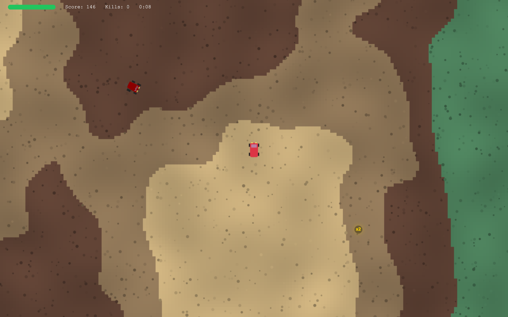
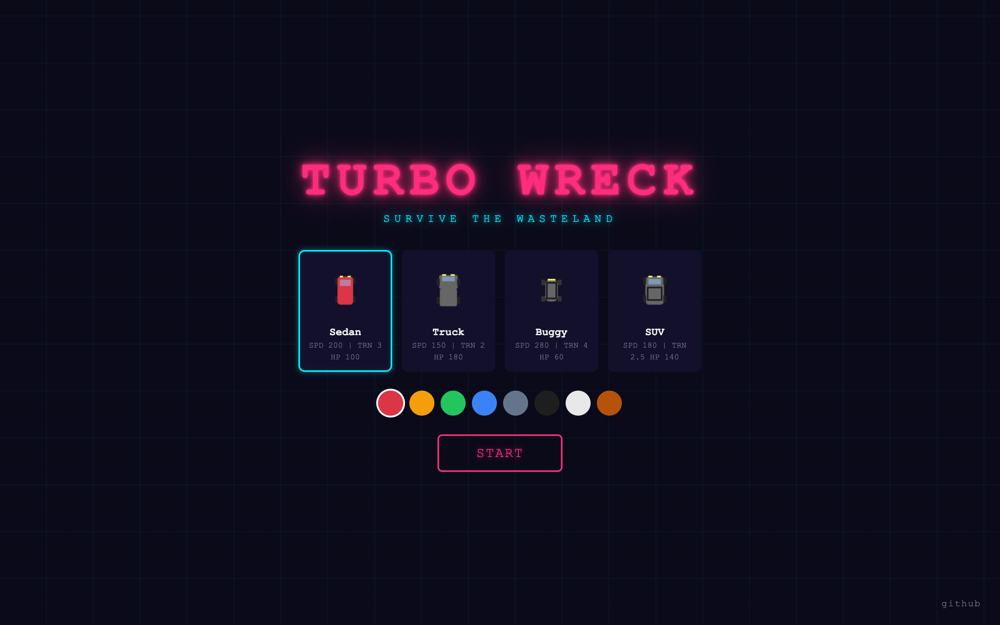
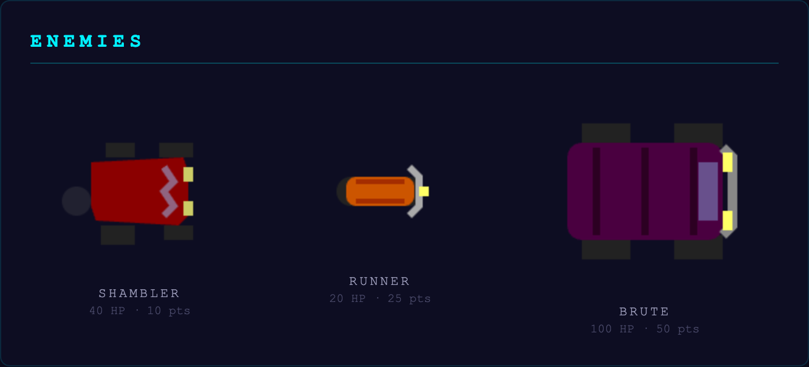
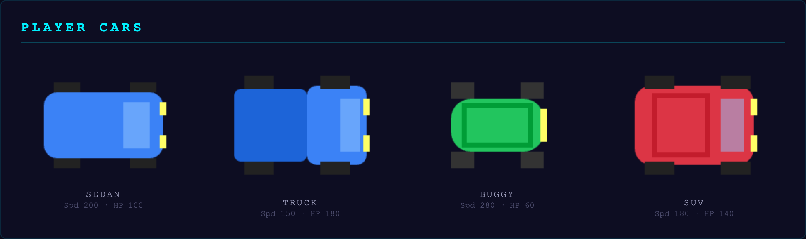
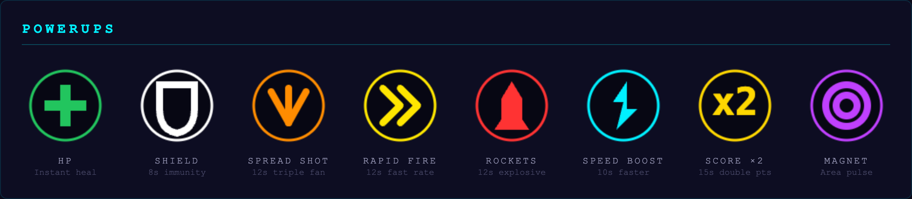

# Turbo Wreck

Top-down 2D survival driving game. Single HTML file, no dependencies, no build step.

## Play Online

[turbowreck.com](https://turbowreck.com)

Or open `index.html` locally in any browser.

## Controls

- **W / Arrow Up** — Accelerate
- **S / Arrow Down** — Brake / Reverse
- **A / Arrow Left** — Steer left
- **D / Arrow Right** — Steer right
- **Space** — Shoot
- **Escape** — Pause / Resume
- **K** — Self-destruct (testing)
- **`** — Toggle debug overlay

A controls explanation screen is shown before each new game.

## Features

### Cars & Customization

- 4 car types (Sedan, Truck, Buggy, SUV) with distinct stats (speed, handling, HP, fire rate)
- 8-color picker — selected color applies to car preview and in-game model

### World
- Infinite procedural terrain using chunk-based simplex noise
- Multi-layer biome generation: elevation, moisture, and detail noise create large coherent regions with organic boundaries
- 5 terrain types (Grass, Dirt, Gravel, Mud, Dry Earth) each with unique speed modifiers
- Per-tile color jitter for natural visual texture
- 3-tier chunk caching (active / hot / cold) for bounded memory usage

### Enemies

- 3 enemy types with scaling spawn rates:
  - **Shambler** — slow, steady, moderate HP
  - **Runner** — fast with zigzag movement, low HP
  - **Brute** — tanky and hard-hitting, spawns later in the run
- Spatial grid collision for efficient hit detection

### Cars & Combat

### Powerups

- 8 powerup drops from enemies and periodic world spawns:
  - **Spread Shot** — triple-bullet fan
  - **Rapid Fire** — increased fire rate
  - **Rockets** — explosive projectiles with splash damage
  - **HP** — instant health restore
  - **Speed Boost** — temporary movement buff
  - **Shield** — temporary damage immunity
  - **Score ×2** — double points for a duration
  - **Magnet** — area damage pulse around the car
- Active powerup timers shown in the HUD

### UI & Flow
- Controls explanation screen shown on first start
- Pause screen with resume and quit-to-menu options
- Game-over screen with final stats (score, kills, survival time)
- Save/resume via localStorage — close the tab and pick up where you left off
- HUD with health bar, score, kill counter, and survival timer
- Debug overlay (backtick key): FPS, chunk counts, pool usage, world position

## Tech

- Vanilla ES6+ JavaScript
- Canvas 2D rendering
- DOM overlays for UI (menu, HUD, pause, controls, game-over)
- Deterministic simplex noise for seamless infinite terrain
- Fixed-timestep game loop with smooth camera follow
- Object pools for enemies, bullets, and drops — zero runtime allocation
- Spatial grid for collision queries
